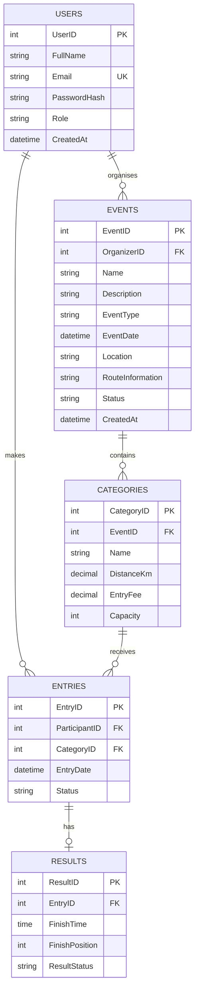

# Race Day — Entity Relationship Diagram

```mermaid
erDiagram
    USERS ||--o{ EVENTS : organises
    EVENTS ||--o{ CATEGORIES : contains
    USERS ||--o{ ENTRIES : makes
    CATEGORIES ||--o{ ENTRIES : receives
    ENTRIES ||--o| RESULTS : has

    USERS {
        int UserID PK
        string FullName
        string Email UK
        string PasswordHash
        string Role
        datetime CreatedAt
    }

    EVENTS {
        int EventID PK
        int OrganizerID FK
        string Name
        string Description
        string EventType
        datetime EventDate
        string Location
        string RouteInformation
        string Status
        datetime CreatedAt
    }

    CATEGORIES {
        int CategoryID PK
        int EventID FK
        string Name
        decimal DistanceKm
        decimal EntryFee
        int Capacity
    }

    ENTRIES {
        int EntryID PK
        int ParticipantID FK
        int CategoryID FK
        datetime EntryDate
        string Status
    }

    RESULTS {
        int ResultID PK
        int EntryID FK
        time FinishTime
        int FinishPosition
        string ResultStatus
    }
```
